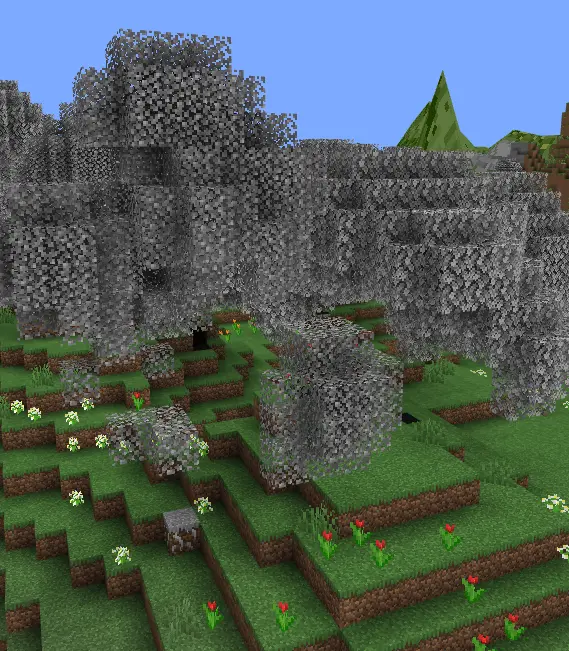
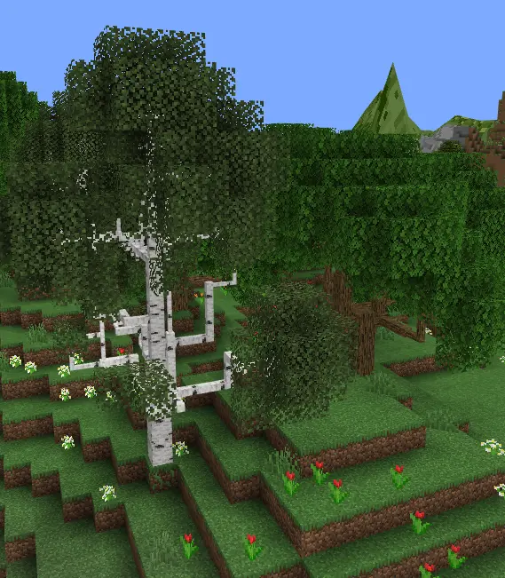

# BlueMap DynamicTrees Addon

[BlueMap](https://bluemap.bluecolored.de/) addon that renders [DynamicTrees](https://modrinth.com/mod/dynamictrees)' branches.

## Features

- Renders branches, thick trunks and roots.
- Makes vanilla leaves and rooty soils colored.
  - For modded leaves consider [my BlueMap Compat Forge mod](https://github.com/Zhincore/bluemap-zhins-compat)

| Without this addon | With this addon |
| --- | --- |
|  |  |

Tested on Minecraft 1.20.1 with BlueMap version `5.12` and DynamicTrees version `1.4.9`.

### Todo

- [ ] Improve thick branch rendering (mainly UVs)
- [ ] Improve roots rendering

## Installation

Put the .jar in the `packs` folder of BlueMap config.

## Credits

Loading logic inspired by [BlueMapModelLoaders](https://github.com/Uiniel/BlueMapModelLoaders).

Branch rendering was partially implemented using Claude Sonnet 4.5 referencing the original Dynamic Trees code.
